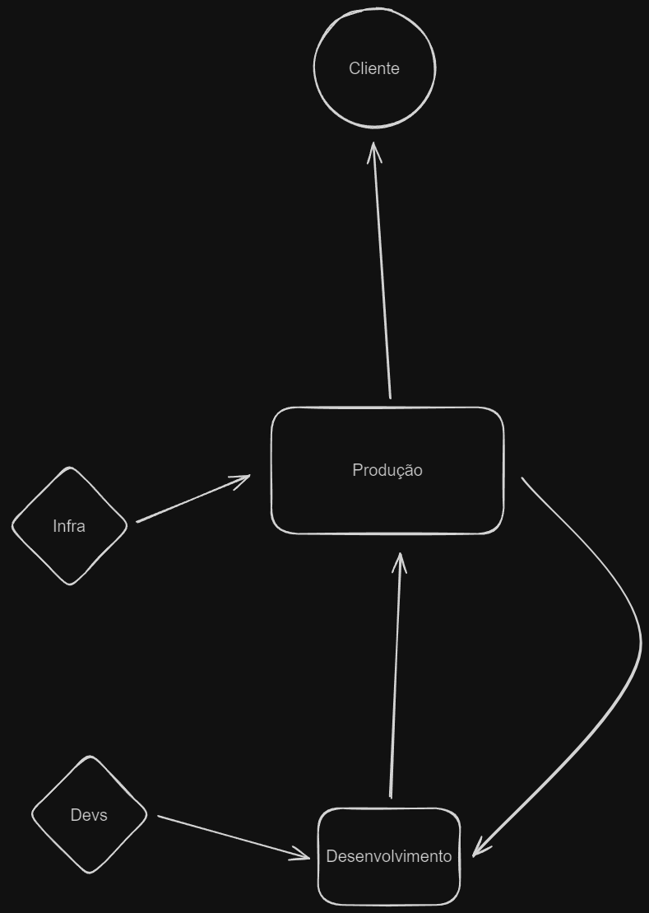
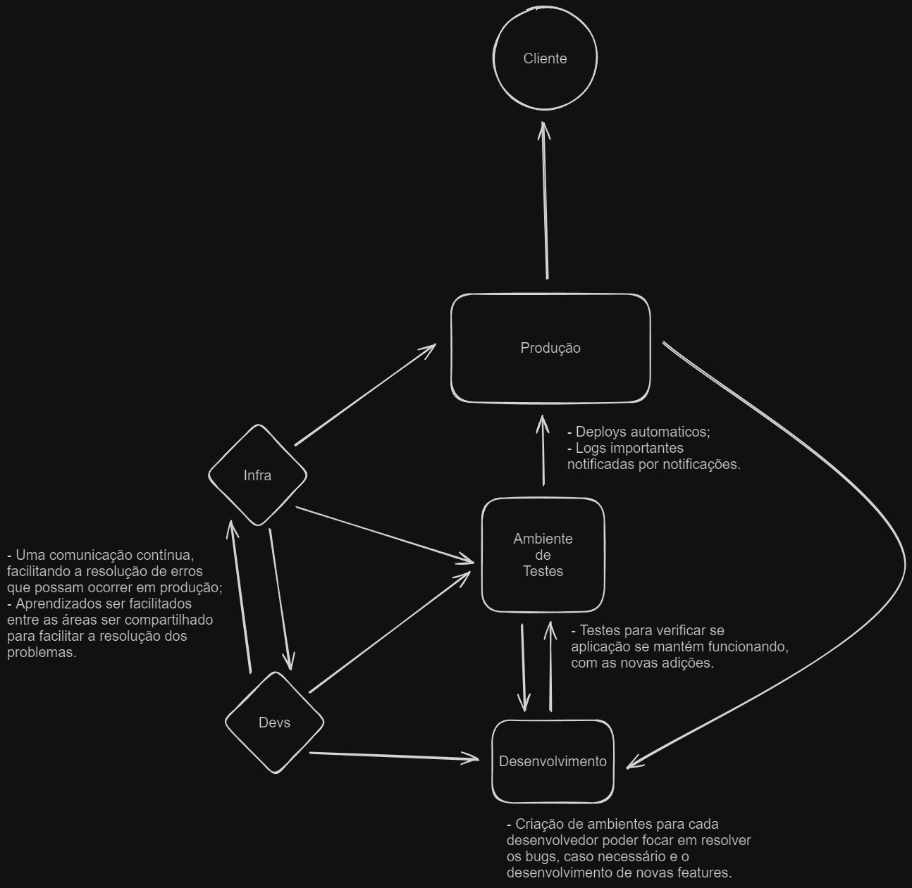

# Desafio: Implementação de Práticas DevOps em um Ambiente Empresarial Fictício

- **Observações algumas alterações foram feitas, devido aos direitos do desafio serem da** [RocketSeat](https://app.rocketseat.com.br/journey/devops/contents)

### Introdução

- Nesse desafio, deverá ser utilizar os conceitos de [CALMS](https://www.atlassian.com/br/devops/frameworks/calms-framework) e as [Três Maneiras](https://eficienciadigitaleia.com.br/2020/07/13/as-3-maneiras-do-devops/) do DevOps para identificar oportunidades para aprimorar os processos existentes e propor soluções que cultivem uma cultura de colaboração, automação e aprendizado contínuo.

### Descrição da empresa

A **Tech** é uma empresa fictícia especializada em desenvolvimento de software, que oferece soluções inovadoras para clientes de diversos setores. Sua missão é simplificar a vida das pessoas através da tecnologia.

#### Equipe

- Desenvolvimento: 12 desenvolvedores com experiência em Java, C# e JavaScript. Apenas um profissional tem conhecimento em COBOL, a linguagem do sistema legado.
- Operações: A equipe de operações, composta por 4 profissionais, enfrenta desafios para manter a infraestrutura de TI e os sistemas em funcionamento eficiente, frequentemente lidando com problemas de escalabilidade e desempenho.

#### Projetos em andamento

1. Sistema de Gestão de Vendas (LEGADO): Um aplicativo para gerenciamento de vendas que inclui controle de estoque, emissão de notas fiscais e relatórios de vendas.
2. Plataforma de E-commerce: uma plataforma de e-commerce escalável para clientes do setor varejista.

#### Descrição dos processos atuais da empresa

1. **Entrega de Código:** Após a conclusão do desenvolvimento de um novo recurso, os desenvolvedores preparam um pacote de implantação e o encaminham à equipe de operações.
2. **Deploy:** O deploy é realizado manualmente no ambiente de produção, sem seguir um procedimento padronizado ou utilizar automação.
3. **Testes:** A equipe de operações conduz testes manuais no ambiente para verificar a funcionalidade e a integridade do código após o deploy em produção.
4. **Monitoramento:** Após o deploy, a equipe de operações monitora manualmente o sistema de logs do servidor, para identificar problemas ou falhas que possam surgir.

#### Dados de desempenho

- Tempo médio entre a entrega do código e o deploy: 3 dias.
- Taxa de sucesso dos deploys manuais: 75%.
- Número de incidentes após o deploy: média de 2 por semana.
- Tempo médio de recuperação (MTTR) de incidentes: 5 horas.

## Resolução

1. **Diagnóstico Cultural (C de CALMS)**:
    - Os processos que iria ser facilitados se essa empresa adotar as práticas de DevOps, seria:
        - Um ambiente de compartilhamento maior de conhecimento;
        - As duas equipes conhecer um pouco de cada áreas, para melhorar a comunicação, caso ocorra um erro que o sistema não conseguiu resolver sozinho;
        - Um ambiente de testes que facilita a identificação de erros antes de deploys;
        - O valor gasto com a aplicação em produção pode reduzir, então os custos de um deploy ruim seriam quase nulos.
        - O tempo de entrega diminui e os incidentes também.
    - Os pontos que fazem essa empresa precisar adotar as práticas de DevOps, são:
        - Depender de um desenvolvedor para a manutenção do sistema LEGADO;
        - Todos os deploys e monitoramentos serem manuais;
        - Uma taxa de sucesso não segura e uma recuperação de incidentes ser de 5 horas;
        - Dificuldades para poderem testar novas *features*.
        - Não existir nenhum tipo de teste para verificar se tudo aquilo que o desenvolvedor fez irá funcionar em produção.
2. **Automação (A de CALMS)**:
    - Possiveis automações que possam ser adicionadas:
        - Deploys automáticos;
        - Testes automatizados que verificam se a aplicação irá funcionar com as novas adições;
        - Os monitoramentos, podendo ser avisados por emails ou notificações no celular, caso ocorra um erro ou sucesso;
        - O pacote de implementação serem reunidos e enviados de forma automático, para uma fila de testes par, ai sim, ir para fila de deploy.
3. **Mensuração e Compartilhamento de Conhecimento (M e S de CALMS)**:
    - Os principais impactos com essas automações:
        - A taxa de erro seria menor;
        - O monitoramento não precisaria o tempo todo de um operador observado;
        - As novas *features* seriam entregues mais rápidas;
        - As recuperações do sistema mais rápidas;
        - Os custos diminuíram;
        - Comunicação entre operação e desenvolvedores seria mais constante.
    - Disseminação do conhecimento:
        - Com a implementação das práticas DevOps, pode ser pensando uma refatoração de código LEGADO para que mais desenvolvedores possam fazer a manutenção do sistema, e não necessitar de um desenvolvedor com todo conhecimento. Assim a equipe de desenvolvimento poderiam auxiliar uns aos outros para agilizar a entrega de novas *features* ou resolução de bugs. Além também de que a operação começaria a entrar em contato mais com os desenvolvedores apresentando as logs de erros diretamente no email da equipe que fez o deploy que ocorreu o erro.
4. **Três Maneiras**:
    - *Antes das Três Maneiras*:
    
    - *Estrutura pensada pelo autor*:
    
